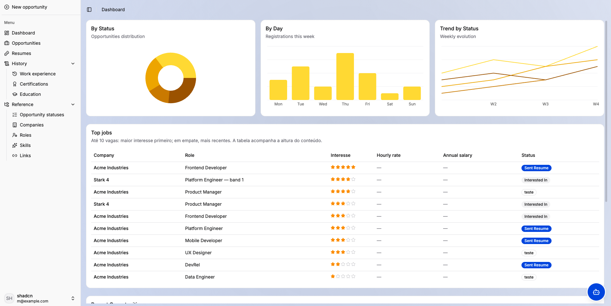
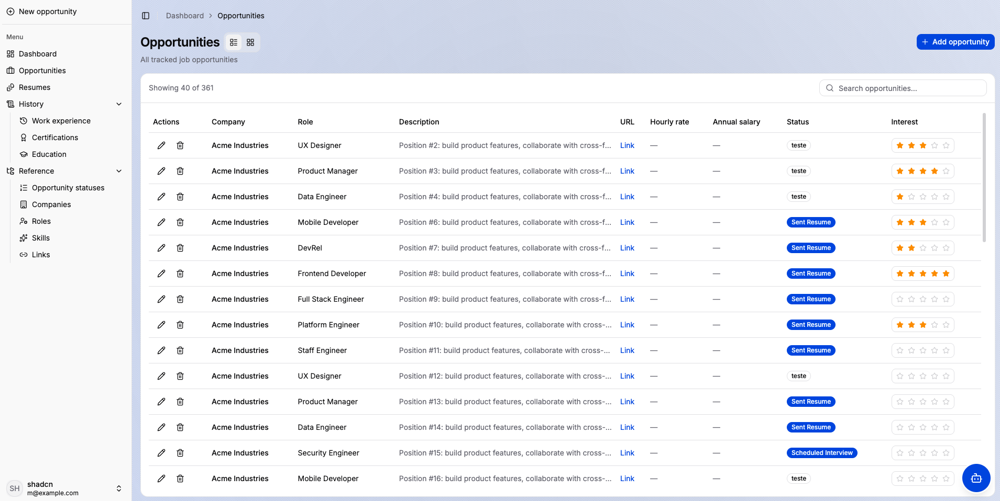
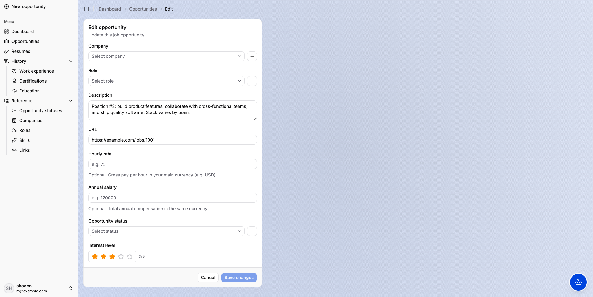
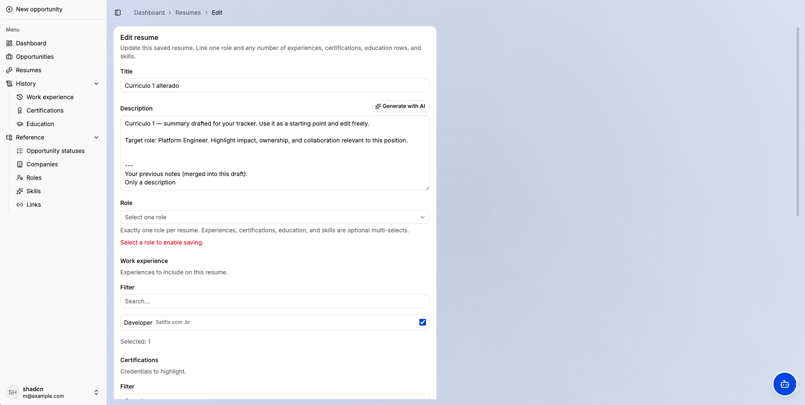
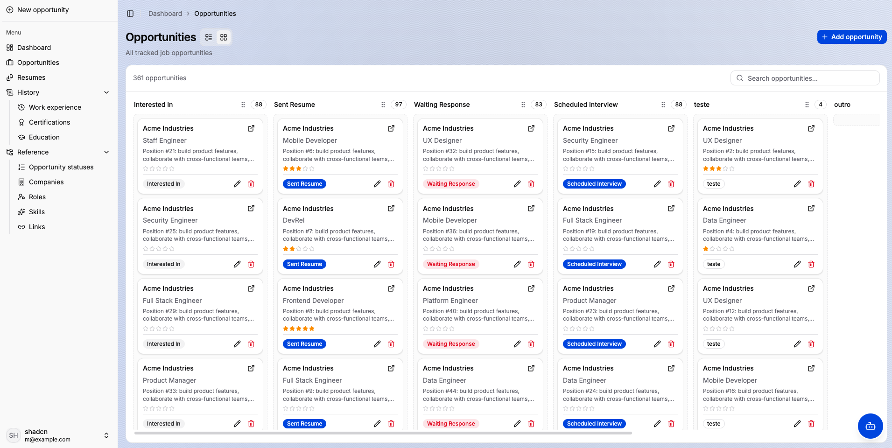
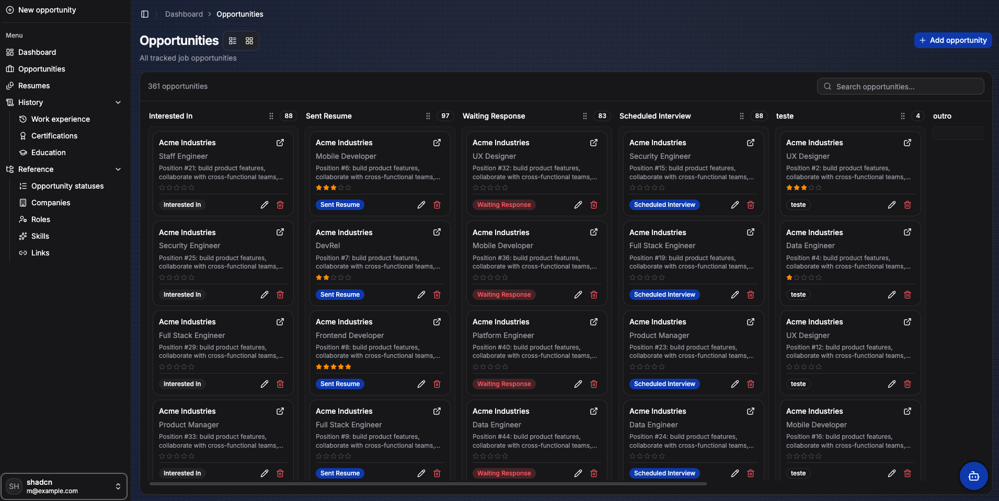
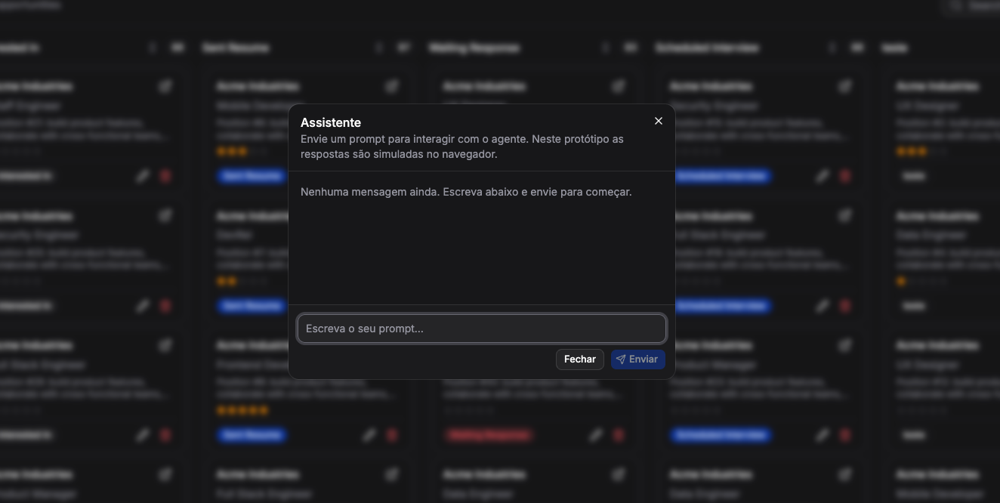

# Vacancy Manager — UI Layout

Front-end reference application for tracking job opportunities, resumes, and supporting profile data. It ships as a **React Router v7** SPA with **shadcn/ui**, **Tailwind CSS v4**, and **client-side mock state** (ready to map to a server-driven stack such as Rails + Inertia — see [`docs/rails-integration/README.md`](docs/rails-integration/README.md)).

---

## Application overview

### Authentication and entry

- **Login** (`/`) — sign-in shell.
- **Register** (`/register`) — account creation.
- **Recover password** (`/recover-password`) — password reset flow shell.
- **Home** (`/home`) — post-auth landing.

_No screenshots are included for these flows._

### App shell

After authentication, the experience is wrapped in **`AppLayout`**: collapsible sidebar, page title and breadcrumbs, and consistent spacing. **Light and dark themes** are supported across the main views (e.g. Kanban).

### Dashboard

The dashboard is the high-level overview of your search: trend charts (built with Recharts), KPI-style summaries, and ranked tables so you can see which opportunities matter most without opening each record.

The screenshot below shows the **analytics strip** (time-based metrics you can correlate with activity) and a **“top jobs” style table** listing standout opportunities with key columns — ideal for a weekly review directly from `/dashboard`.



### Opportunities

Across `/opportunities` you can switch between a dense **table** and a **Kanban** board, edit a single opportunity on `/opportunities/opportunity/:id?`, quick-create from the sidebar dialog, and maintain pipeline definitions under `/opportunities/statuses` and `/opportunities/status/...`.

#### Table view

Here you browse many opportunities at once: pagination-style listing with sortable columns, links into detail/edit, and the same global chrome (sidebar, header) as the rest of the app. Use this mode when you care about comparing fields across rows or scanning large backlogs.



#### Opportunity create / edit form

This screen is the **full-page editor** for one vacancy: role, company, compensation hints, status/column placement, notes, and links to reference entities. Routes without an `id` behave as create; with an `id`, as edit — matching the optional `:id?` pattern in [`app/routes.ts`](app/routes.ts).



### Resumes

Resumes live under `/resumes` with per-resume editing on `/resumes/resume/:id?`. The UI is oriented around **structured profile data** you can reuse when applying — not a freeform document only.

The capture below shows the **resume edit surface**: field groups for identity and application-related content, consistent with the same `AppLayout` and form patterns used elsewhere.



### Opportunities — Kanban board

Still under `/opportunities`, the Kanban lays vacancies out as **cards per pipeline column**. You can drag cards between columns (via `@dnd-kit`) to reflect stage changes visually.

#### Kanban board — light theme

The light theme illustrates default styling on neutral backgrounds — columns typically mirror configured statuses or custom board columns.



#### Kanban board — dark theme

The same board in **dark mode** keeps contrast for long sessions and demonstrates that layout, drag handles, and column headers remain readable when the shell uses a dark palette (see also theme handling in the app layout).



### AI assistant

The **floating assistant** (see [`app/components/layout/floating-agent-assistant.tsx`](app/components/layout/floating-agent-assistant.tsx)) opens a modal on top of the current page so you can ask for help or suggestions **without losing your place** in the Kanban or table.

In the image, the assistant sits **above the dark Kanban**: the board stays visible behind a dimmed backdrop, illustrating the overlay pattern used for contextual Q&A while managing opportunities.



### Reference data (sidebar — “Reference”)

Shared catalogs used across opportunities and resumes:

| Area | Routes |
|------|--------|
| Companies | `/companies`, `/companies/company/:id?` |
| Roles | `/roles`, `/roles/role/:id?` |
| Skills | `/skills`, `/skills/skill/:id?` |
| Links | `/links`, `/links/link/:id?` |

_Create and edit typically share one route module with an optional `id` (new vs edit)._

_No screenshots are included for these list/form screens._

### Professional profile blocks (sidebar — “History”)

- **Work experience** — `/work-experiences`, `/work-experiences/work-experience/:id?` (including skill associations where applicable).
- **Certifications** — `/certifications`, `/certifications/certification/:id?`
- **Education** — `/educations`, `/educations/education/:id?`

### My data

- **Profile** — `/my-data` for the signed-in user’s own data shell.

_No dedicated screenshot._

---

## Screenshot gallery

Quick reference: each row matches a section above; the **What it shows** column summarizes the screen at a glance.

| Screen | What it shows | Asset |
|--------|----------------|--------|
| Dashboard | Charts plus a ranked opportunities table for pipeline health at a glance. | [`dashboard-analytics-and-top-jobs-table.png`](docs/images/2026-05-01-14-41-17-dashboard-analytics-and-top-jobs-table.png) |
| Opportunities (table) | Dense, sortable list of vacancies with navigation into details. | [`opportunities-list-table-view.png`](docs/images/2026-05-01-14-41-33-opportunities-list-table-view.png) |
| Opportunity form | Full editor for one opportunity (fields tied to companies, roles, status/column). | [`edit-opportunity-form.png`](docs/images/2026-05-01-14-41-41-edit-opportunity-form.png) |
| Resume form | Structured resume editing inside the standard app chrome. | [`edit-resume-form.png`](docs/images/2026-05-01-14-41-51-edit-resume-form.png) |
| Kanban (light) | Card columns for stages on a light UI theme; drag-and-drop between columns. | [`kanban-board-light-theme.png`](docs/images/2026-05-01-14-42-06-opportunities-kanban-board-light-theme.png) |
| Kanban (dark) | Same board semantics with dark palette for readability in low light. | [`kanban-board-dark-theme.png`](docs/images/2026-05-01-14-42-14-opportunities-kanban-board-dark-theme.png) |
| AI assistant | Modal overlay on top of Kanban for help without leaving the board. | [`ai-assistant-modal-over-kanban-dark.png`](docs/images/2026-05-01-14-42-21-ai-assistant-modal-over-kanban-dark.png) |

---

## Tech stack

- **React 19** + **TypeScript**
- **React Router 7** — route config in [`app/routes.ts`](app/routes.ts)
- **Tailwind CSS v4** + **shadcn/ui** — primitives under [`app/components/ui/`](app/components/ui/)
- **@dnd-kit** — Kanban drag-and-drop
- **Recharts** — dashboard charts
- **Client mock data** — `AppDataProvider` and related context until a real API replaces it

---

## Getting started

```bash
npm install
npm run dev
```

Other scripts:

```bash
npm run build   # production build
npm run start   # serve production build
npm run typecheck
npm run format
```

UI components follow the project’s shadcn layout; add new primitives with the shadcn CLI if needed — existing patterns live under `app/components/ui/`.
