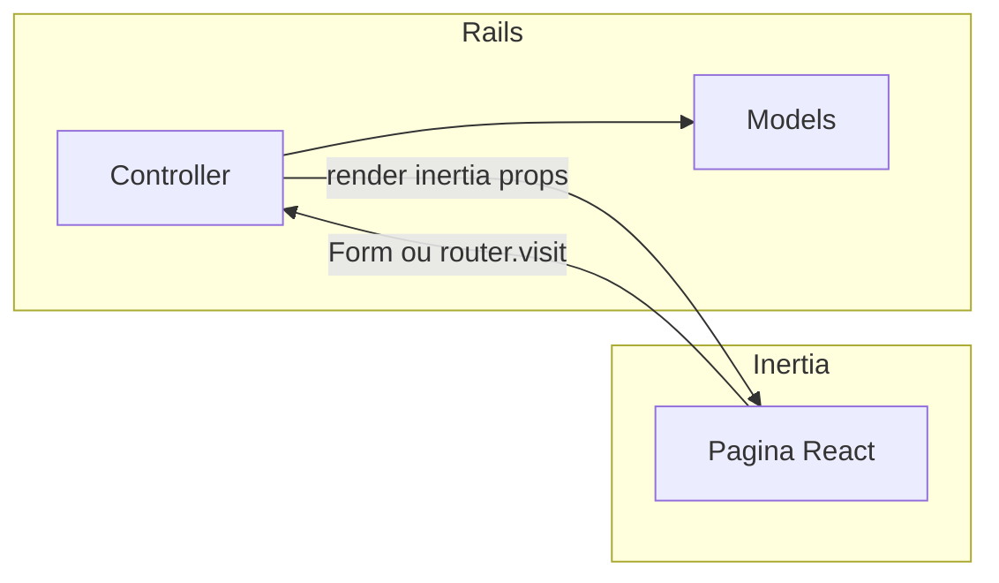

# Estrutura da pasta `app/`

Voltar ao [índice](./README.md).

## Visão geral

O front-end deste repositório é uma aplicação **React** servida pelo ecossistema **React Router v7**. Toda a UI vive sob `app/`, com páginas em `app/routes/` e componentes reutilizáveis em `app/components/`. Não há servidor Ruby nem Inertia aqui; a estrutura serve como **modelo de pastas e responsabilidades** ao portar para Rails.

## Alias de importação (`~/`)

No `tsconfig.json`, o alias `~/*` aponta para `./app/*`. Exemplos comuns:

- `~/components/ui/button`
- `~/components/providers/app-data-provider`
- `~/lib/utils`

No projeto Rails + Vite, o time costuma definir um alias equivalente (`@/` ou `~/`) no bundler para que os imports dos componentes shadcn e de domínio permaneçam estáveis após a cópia dos arquivos.

## Árvore lógica (resumo)

```
app/
├── app.css                 # Estilos globais (Tailwind v4)
├── root.tsx                # HTML shell, Meta, providers raiz, ErrorBoundary
├── routes.ts               # Declaração central de rotas (RR7)
├── routes/                 # Uma rota ≈ uma “página”
├── components/
│   ├── ui/                 # Primitivos shadcn (Button, Dialog, Field, …)
│   ├── layout/             # AppLayout, sidebar, navegação, assistente flutuante
│   ├── listing/            # Cabeçalhos de lista, tabela em Card, infinite scroll
│   ├── auth/               # Login, registro, recuperação (shell + forms)
│   ├── providers/          # AppDataProvider, SessionUserProvider
│   ├── shared/             # Componentes transversais (ex.: pós-cadastro)
│   ├── opportunities/      # Kanban, diálogos, campos de formulário de oportunidade
│   ├── resume/             # Currículo: fieldsets, diálogo de IA
│   └── work-experience/    # Fieldset de skills na experiência
├── hooks/                  # Hooks de UI (ex.: lista infinita, mobile)
└── lib/                    # Utilitários, seeds mock, labels, tema
```

No Rails + Inertia, costuma-se espelhar **apenas** a parte de componentes e páginas no diretório que o gerador define (por exemplo `app/frontend/pages` ou `app/javascript/pages`), mantendo a mesma **separação** entre `ui`, `layout` e domínio.

## `root.tsx`: casca global

Responsabilidades atuais:

- Envolver a árvore com `TooltipProvider`, `AppDataProvider`, `SessionUserProvider`.
- Carregar `app.css` e script inline de tema (`themeBootstrapInlineScript`).
- Renderizar `<Outlet />` como filho das rotas.

**Mapeamento Inertia:** o equivalente é o **layout raiz** da aplicação Inertia (HTML, meta, providers que fazem sentido no cliente) combinado com o que o Rails já entrega no layout ERB ou no primeiro componente persistente. Os providers de **dados de negócio** (`AppDataProvider`) não devem ser copiados como estão; veja [03-dados-e-backend.md](./03-dados-e-backend.md).

## Providers

| Provider | Função hoje | Direção na migração |
|----------|-------------|----------------------|
| `AppDataProvider` | Estado global de entidades + persistência em `localStorage` | Props por controller + ActiveRecord |
| `SessionUserProvider` | Perfil do usuário mock em `localStorage` | `Current.user` + share Inertia ou prop `user` |

## Fluxo de dados (conceitual)

No layout atual, a página consome `useAppData()` e renderiza. No Rails, o fluxo ideal inverte a seta principal:



- **Leitura:** Controller monta hashes/structs (ou serializers) → props da página.
- **Escrita:** Submissão HTTP (form tradicional ou `<Form>` Inertia) → controller altera models → redirect ou re-render com novas props.

## Organização “Rails way” sugerida (espelho conceitual)

| Pasta atual `app/` | Onde costuma viver no stack Rails + Inertia |
|--------------------|---------------------------------------------|
| `routes/*.tsx` (páginas) | Páginas Inertia (ex.: `Companies/Index.tsx`) + actions em controllers |
| `components/ui/` | Continua como biblioteca de UI (shadcn) |
| `components/layout/` | Layout persistente Inertia ou wrapper compartilhado |
| `lib/labels.ts`, tipos de domínio | Pode migrar para contratos compartilhados (TypeScript gerado, OpenAPI, ou duplicação consciente com Alba no Ruby) |

Este documento não prescreve nomes exatos de pastas no gerador Vite do Rails; o time deve seguir o padrão do `bin/rails inertia:install` ou documentação interna.
